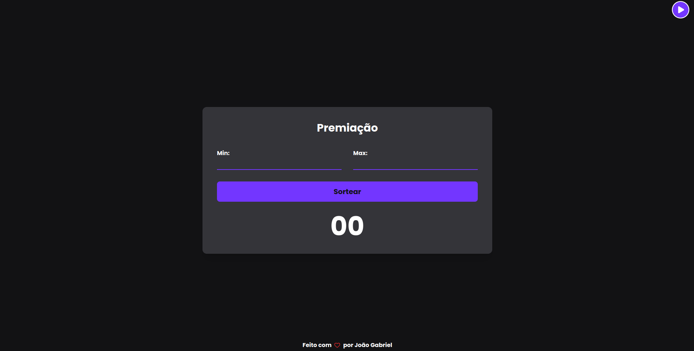

# Raffle Numbers



A idea deste projeto surgiu, durante um evento na igreja, com a necessidade de ter uma aplicação simples onde possa sortear números de forma aleatória delimitando seus limites - ou seja, sortear números de 1 a 100 ou de 20 a 80. Para proporcionar um ambiente mais animado, a aplicação também possue efeitos sonoros propícios para a situação como uma música de fundo e uma música de suspense ao sortear um número aleatório. Resumidamento, é só isso por até o momento. 💙


## Quer testar agora mesmo?

[Clique aqui](https://raffle-numbers.vercel.app/) para usar o Sorteador de Números
## 👨‍💻 Autores

- [João Gabriel](https://www.github.com/JGabriel963)
- [John Emerson](https://www.github.com/johnggli)


## Funcionalidades

O projeto é simples e fácil de usar, possuindo, por enquanto, somente algumas funções.

- Música de fundo
- Limitar intervalo de números a ser sorteado
- Sorte número aleatório 
- Responsivo


## Rodando localmente

Clone o projeto

```bash
  git clone https://link-para-o-projeto
```

Entre no diretório do projeto

```bash
  cd my-project
```

Inicie o servidor

```bash
  npm run dev
```


## Stack utilizada

**Front-end:** React and TailwindCSS


